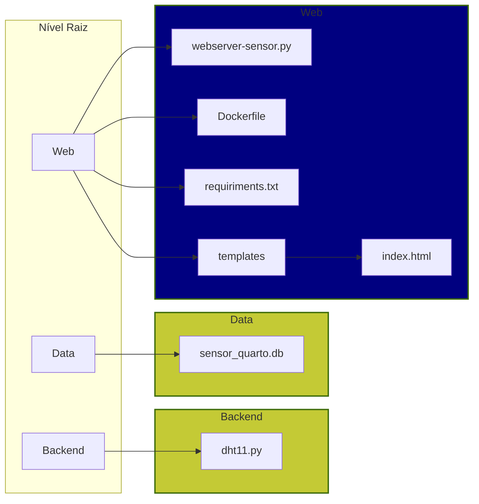

#Projeto de medição de temperatura e umidade usando o raspberry pi e o sensor DHT11

#Estrutura do projeto

```mermaid 
graph LR
  subgraph Nível Raiz
    data[Data]
    web[Web]
    backend[Backend]
  end

  subgraph Backend
    style Backend fill:#c4ca35,stroke:#3E6C0A,stroke-width:2px
    dht11.py[dht11.py]
  end

  subgraph Data
    style Data fill:#c4ca35,stroke:#3E6C0A,stroke-width:2px
    sensor_quarto.db[sensor_quarto.db]
  end

  subgraph Web
    style Web fill:#000080,stroke:#3E6C0A,stroke-width:2px
    webserver-sensor.py[webserver-sensor.py]
    dockerfile[Dockerfile]
    requiriments.txt[requiriments.txt]
    templates[templates]
    index.html[index.html]
    
  end


  data --> sensor_quarto.db
  web --> webserver-sensor.py
  web --> dockerfile
  web --> requiriments.txt
  web --> templates
  backend --> dht11.py
  templates --> index.html
```
